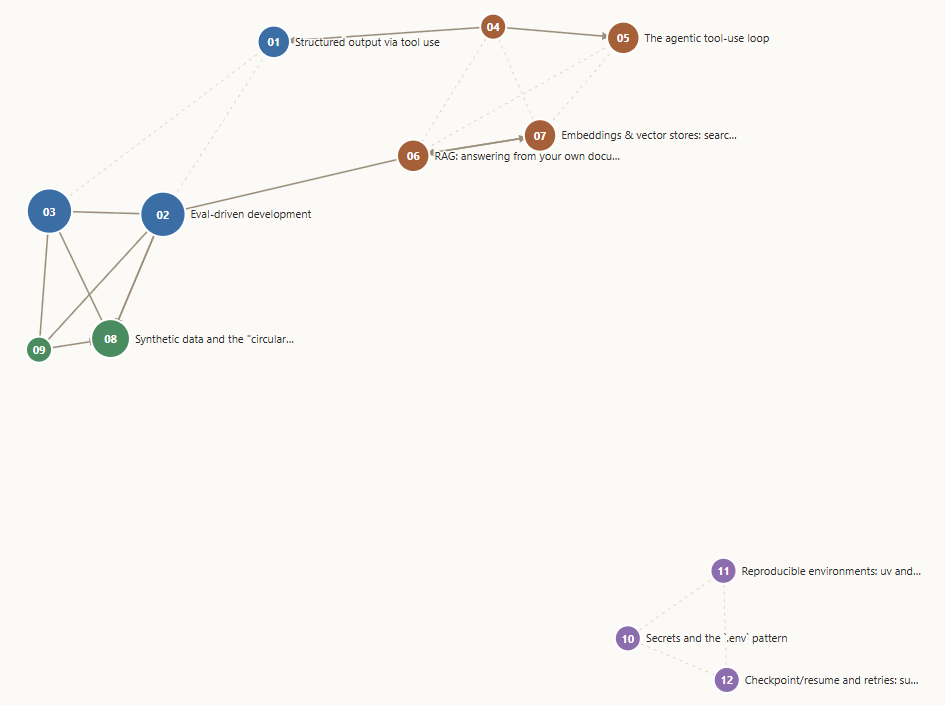

# Learning Notes

Plain-language notes on the ideas behind my projects. These started as private notes
just for me; I've since made them **public** — as a backup, and because mapping how the
concepts connect helps me see how my own projects fit together. The goal is to
*understand* the concepts, not just have working code, and to keep adding over time.

<p align="center">
  <a href="https://sanlee-ys.github.io/learning-notes/concept-map.html">
    
  </a>
  <br>
  <em><a href="https://sanlee-ys.github.io/learning-notes/concept-map.html">▶ Open the interactive map</a> — drag nodes, hover to read a note's TL;DR, click to open it.<br>
  Nodes are colored by category: Foundations · LLM app patterns · Data &amp; method · Engineering hygiene.</em>
</p>

## How to use this

Each note is short and follows the same five-part shape:

1. **Plain idea** — the concept in everyday words, no jargon.
2. **Analogy** — a real-world comparison so it sticks.
3. **In my project** — where I actually used it, with the file name.
4. **Why it matters** — what problem it solves / what it buys me.
5. **Go deeper** — questions to chase when I want to expand this note.

To add a concept: copy that shape into a new `NN-name.md` file and tick it off below.
Keep it simple first; expand later. A half-written note is fine. After adding or editing
a note, run `python build_site.py` to refresh the viewable `index.html` (see below).

## Concept map

Concepts pulled from my two projects. `[x]` = written, `[ ]` = planned.

### Foundations
- [x] 01 — Structured output via tool use *(both projects)*
- [x] 02 — Eval-driven development: knowing if a change actually helped *(classifier)*
- [x] 03 — Reading the numbers: accuracy vs precision/recall/F1 *(classifier)*

### LLM app patterns
- [x] 04 — Tool use / function calling, the general idea *(both)*
- [x] 05 — The agentic tool-use loop: letting the model decide *(kb-agent)*
- [x] 06 — RAG: answering from your own documents *(kb-agent)*
- [x] 07 — Embeddings & vector stores: search by meaning *(kb-agent)*

### Data & method
- [x] 08 — Synthetic data and the "circular eval" trap *(classifier)*
- [x] 09 — Tiered model routing: paying for the big model only when it pays *(classifier v2)*

### Engineering hygiene
- [x] 10 — Secrets and the `.env` pattern *(both)*
- [x] 11 — Reproducible environments: uv and lockfiles *(both)*
- [x] 12 — Checkpoint/resume and retries: surviving flaky API runs *(classifier)*

## Viewing the notes

Four ways to read these as more than raw text. The `.md` files always stay the source of
truth — the viewers are regenerated, never hand-edited.

### 1. Single page — zero install

```bash
python build_site.py        # regenerates index.html
```

Open **`index.html`** in any browser (double-click). One offline file — no server, no
install, no internet — with a sidebar and a **search box** that filters notes as you type.
Re-run `build_site.py` after editing or adding a note.

### 2. Polished site — MkDocs Material

A themed, fully searchable site with dark mode. Uses a one-time toolchain via uv (no
permanent install). From this folder:

```bash
uv run --no-project --with mkdocs-material mkdocs build   # → ../learning-notes-site/
uv run --no-project --with mkdocs-material mkdocs serve   # live preview at :8000
```

Then open **`../learning-notes-site/index.html`** to read it offline. Note: the
**dark-mode toggle only works when the site is served over HTTP** (`mkdocs serve` above, at
http://127.0.0.1:8000) — opened as a bare `file://` page the light/dark switch can't run,
though layout, search, and everything else do. When you add a note, add one line to
`mkdocs.yml`'s `nav:` (option 1 picks new notes up automatically; this one needs the line).

> **Gotcha:** if you've set `UV_ENV_FILE=.env` globally (the convention from the classifier
> project), these `uv` commands fail here looking for a `.env`. Prefix them with
> `UV_ENV_FILE= ` (note the trailing space) or run `unset UV_ENV_FILE` first.

### 3. Chat with them — kb-agent

`kb-agent` indexes this folder (via its `notes_dirs:` setting) into its knowledge base, so
you can ask questions and get answers grounded in these notes *with citations*. See that
project's README to run the chat UI.

### 4. See how they connect — concept map

```bash
python build_graph.py       # regenerates concept-map.html
```

Open **`concept-map.html`** for a force-directed graph of every note: each note is a node
(colored by category, larger when more notes point at it), and the lines are the in-text
"note NN" cross-references. **Drag** nodes to rearrange, **hover** to focus a note and read
its TL;DR, and **click** a node to jump straight to it in `index.html`. Needs internet on
first open (D3 loads from a CDN). Re-run `build_graph.py` after editing or adding a note.

Or view it live, no install: **https://sanlee-ys.github.io/learning-notes/concept-map.html**

## Where these come from

- **defense-news-classifier** — an AI that reads a defense-news snippet and labels it
  (what it's about + which domain). Built to *measure* how well it does.
- **kb-agent** — an AI assistant that answers questions about my projects by searching
  a personal notebook of Markdown files (this is the "RAG" project).
